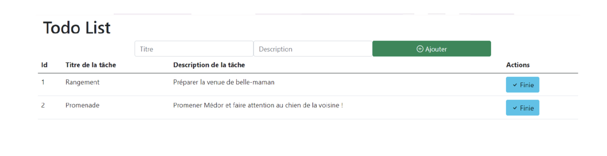

### TP 1 Asp.NET Core

**Objectif:** Mettre en place les différentes notions d'aps.net core (controller, view, model, EFCore, ...)

- Le but de l'exercice est de réaliser une TodoList permettant aux utilisateurs d’avoir accès à une liste de tâche se présentant comme sur l’exemple ci-dessus. 
- Ces tâches pourront être "terminée" ou "en cours".
- Ces tâches pourront être supprimées.
- On stockera ces tâches dans une base de données avec EFCore (utiliser le Repository Pattern)
- L'application n'aura qu'un seul controller "TodoController.cs" et 2 Views "Index.cshtml" et "Form.cshtml"  
  (retirer la partie Home de l'application)

### Exemple d'interface (incomplète)

/!\ sur l'image le formulaire est sur la même page, dans ce sujet on demande 2 pages distinctes